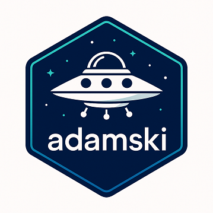

# adamski package
The package is inspired by the R `{admiral}` package and draws on some of their ideas and functions.

  

# Admiral Functions List

This list summarizes all derivation-related functions available in the R `{admiral}` package (approx. 58 functions), grouped by module.  
These functions serve as a reference for creating equivalent SAS macros in the **adamski** package family.

---

## 🗂️ Summary by Category

| Category            | # Functions |
|---------------------|-------------|
| All ADaMs (General) | ~20 |
| ADSL-specific       | 4 |
| BDS-specific        | 11 |
| OCCDS-specific      | 4 |
| Adding Parameters / Records | ~18 |
| TTE-specific        | 1 |
| **Total**           | **~58** |

---

## 🌐 All ADaMs (General)

| Function | Description | Status |
|-----------|-------------|-------------|
| `derive_var_extreme_flag()` | Create extreme value flag |  |
| `derive_var_joined_exist_flag()` | Create flag for joined existence |  |
| `derive_var_merged_ef_msrc()` | Merge and derive event flag by source |  |
| `derive_var_merged_exist_flag()` | Merge and derive existence flag |  |
| `derive_var_merged_summary()` | Merge and summarize records |  |
| `derive_var_obs_number()` | Derive observation sequence number |  |
| `derive_var_relative_flag()` | Derive relative flag |  |
| `derive_var_trtdurd()` | Derive treatment duration (days) |  |
| `derive_vars_cat()` | Derive categorical variables |  |
| `derive_vars_computed()` | Compute derived variables |  |
| `derive_vars_dt()` | Derive date components |  |
| `derive_vars_dtm()` | Derive datetime variables |  |
| `derive_vars_dtm_to_dt()` | Convert datetime to date |  |
| `derive_vars_dtm_to_tm()` | Convert datetime to time |  |
| `derive_vars_duration()` | Derive duration variables |  |
| `derive_vars_dy()` | Derive study day variables |  |
| `derive_vars_joined()` | Derive joined variables |  |
| `derive_vars_merged()` | Derive merged variables |  |
| `derive_vars_merged_lookup()` | Lookup and merge derived variables |  |
| `derive_vars_transposed()` | Derive transposed variables |  |

---

## 🧍 ADSL-specific

| Function | Description | Status |
|-----------|-------------|-------------|
| `derive_var_age_years()` | Derive age in years |  |
| `derive_vars_aage()` | Derive analysis age |  |
| `derive_vars_extreme_event()` | Derive worst/best extreme event |  |
| `derive_vars_period()` | Derive period or phase variables |  |

---

## 📊 BDS-specific

| Function | Description | Status |
|-----------|-------------|-------------|
| `derive_basetype_records()` | Create baseline type records | |
| `derive_var_analysis_ratio()` | Derive analysis ratios | |
| `derive_var_anrind()` | Derive reference range indicator | |
| `derive_var_atoxgr()` | Derive adverse event toxicity grade | |
| `derive_var_atoxgr_dir()` | Derive directional adverse event toxicity grade | |
| `derive_var_base()` | Derive baseline values | |
| `derive_var_chg()` | Derive change from baseline | |
| `derive_var_ontrtfl()` | Derive on-treatment flag | |
| `derive_var_pchg()` | Derive percent change | |
| `derive_var_shift()` | Derive shift table variables | |
| `derive_vars_crit_flag()` | Derive criteria flags | |

---

## 🧾 OCCDS-specific

| Function | Description | Status |
|-----------|-------------|-------------|
| `derive_var_trtemfl()` | Derive treatment-emergent flag | |
| `derive_vars_atc()` | Derive ATC classification variables | |
| `derive_vars_query()` | Derive query-based variables (e.g., MedDRA) | |
| `get_terms_from_db()` | Retrieve terms from query database | |

---

## ➕ Adding Parameters / Records

| Function | Description | Status |
|-----------|-------------|-------------|
| `default_qtc_paramcd()` | Default QTc parameter code | |
| `derive_expected_records()` | Derive expected record structure | |
| `derive_extreme_event()` | Derive extreme events | |
| `derive_extreme_records()` | Derive extreme records | |
| `derive_locf_records()` | Last Observation Carried Forward (LOCF) | |
| `derive_param_bmi()` | Add BMI parameter | |
| `derive_param_bsa()` | Add Body Surface Area parameter | |
| `derive_param_computed()` | Add computed parameter | |
| `derive_param_doseint()` | Add dose interval parameter | |
| `derive_param_exist_flag()` | Add parameter for existence flag | |
| `derive_param_exposure()` | Add exposure parameter | |
| `derive_param_framingham()` | Add Framingham risk score parameter | |
| `derive_param_map()` | Add parameter mapping | |
| `derive_param_qtc()` | Add QTc parameter | |
| `derive_param_rr()` | Add risk ratio parameter | |
| `derive_param_wbc_abs()` | Add absolute WBC parameter | |
| `derive_summary_records()` | Add summary records | |

---

## adamski original

| Function | Description | Status |
|-----------|-------------|-------------|
| `coming soon` | special macro(or function) | |

---
## ⏱️ TTE-specific (Time-to-Event)

| Function | Description | Status |
|-----------|-------------|-------------|
| `derive_param_tte()` | Add Time-to-Event parameter | |

---

## 📝 Usage Notes
- This list reflects `{admiral}` derivation functions as of the current version.
- Additional utility functions like `call_derivation()` or `restrict_derivation()` are **not included** here.
- Naming convention: all derivation functions follow `derive_` or `derive_vars_` prefixes for consistency.

---

## 🔗 Reference
- [Admiral Official Documentation](https://pharmaverse.github.io/admiral/reference/index.html)
- [Admiral GitHub Repository](https://github.com/pharmaverse/admiral)

---

## What is SAS Packages?

The package is built on top of **SAS Packages Framework(SPF)** developed by Bartosz Jablonski.

For more information about the framework, see [SAS Packages Framework](https://github.com/yabwon/SAS_PACKAGES).

You can also find more SAS Packages (SASPacs) in the [SAS Packages Archive(SASPAC)](https://github.com/SASPAC).

## How to use SAS Packages? (quick start)

### 1. Set-up SAS Packages Framework

First, create a directory for your packages and assign a `packages` fileref to it.

~~~~~~~~~~~~~~~~~~~~~~~~~~~~~~~~~~~~~~~~~~~~~~~~~~~~~~~~~~~~~~~~~~~~~~~~~~~~~~~~~~~~~~~~~~sas
filename packages "\path\to\your\packages";
~~~~~~~~~~~~~~~~~~~~~~~~~~~~~~~~~~~~~~~~~~~~~~~~~~~~~~~~~~~~~~~~~~~~~~~~~~~~~~~~~~~~~~~~~~

Secondly, enable the SAS Packages Framework.
(If you don't have SAS Packages Framework installed, follow the instruction in 
[SPF documentation](https://github.com/yabwon/SAS_PACKAGES/tree/main/SPF/Documentation) 
to install SAS Packages Framework.)

~~~~~~~~~~~~~~~~~~~~~~~~~~~~~~~~~~~~~~~~~~~~~~~~~~~~~~~~~~~~~~~~~~~~~~~~~~~~~~~~~~~~~~~~~~sas
%include packages(SPFinit.sas)
~~~~~~~~~~~~~~~~~~~~~~~~~~~~~~~~~~~~~~~~~~~~~~~~~~~~~~~~~~~~~~~~~~~~~~~~~~~~~~~~~~~~~~~~~~

### 2. Install SAS package

Install SAS package you want to use with the SPF's `%installPackage()` macro.

- For packages located in **SAS Packages Archive(SASPAC)** run:
  ~~~~~~~~~~~~~~~~~~~~~~~~~~~~~~~~~~~~~~~~~~~~~~~~~~~~~~~~~~~~~~~~~~~~~~~~~~~~~~~~~~~~~~~~~~sas
  %installPackage(packageName)
  ~~~~~~~~~~~~~~~~~~~~~~~~~~~~~~~~~~~~~~~~~~~~~~~~~~~~~~~~~~~~~~~~~~~~~~~~~~~~~~~~~~~~~~~~~~

- For packages located in **PharmaForest** run:
  ~~~~~~~~~~~~~~~~~~~~~~~~~~~~~~~~~~~~~~~~~~~~~~~~~~~~~~~~~~~~~~~~~~~~~~~~~~~~~~~~~~~~~~~~~~sas
  %installPackage(packageName, mirror=PharmaForest)
  ~~~~~~~~~~~~~~~~~~~~~~~~~~~~~~~~~~~~~~~~~~~~~~~~~~~~~~~~~~~~~~~~~~~~~~~~~~~~~~~~~~~~~~~~~~

- For packages located at some network location run:
  ~~~~~~~~~~~~~~~~~~~~~~~~~~~~~~~~~~~~~~~~~~~~~~~~~~~~~~~~~~~~~~~~~~~~~~~~~~~~~~~~~~~~~~~~~~sas
  %installPackage(packageName, sourcePath=https://some/internet/location/for/packages)
  ~~~~~~~~~~~~~~~~~~~~~~~~~~~~~~~~~~~~~~~~~~~~~~~~~~~~~~~~~~~~~~~~~~~~~~~~~~~~~~~~~~~~~~~~~~
  (e.g. `%installPackage(ABC, sourcePath=https://github.com/SomeRepo/ABC/raw/main/)`)

### 3. Load SAS package

Load SAS package you want to use with the SPF's `%loadPackage()` macro.

~~~~~~~~~~~~~~~~~~~~~~~~~~~~~~~~~~~~~~~~~~~~~~~~~~~~~~~~~~~~~~~~~~~~~~~~~~~~~~~~~~~~~~~~~~sas
%loadPackage(packageName)
~~~~~~~~~~~~~~~~~~~~~~~~~~~~~~~~~~~~~~~~~~~~~~~~~~~~~~~~~~~~~~~~~~~~~~~~~~~~~~~~~~~~~~~~~~

### Enjoy!

---

